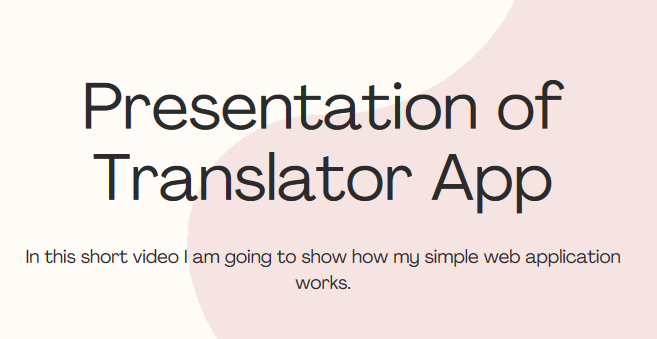

<div align="center">
<h1>The project is a web application designed to aid in learning the English language by translating words and sentences.</h1>
<h1> It utilizes a free API for translations and provides a simple user interface where users can create sections and add words to them.</h1>
</div> <br>

### Before downloading and installing the application I would like to invite you to watch a short presentation of the app. In this short video you will find out how to use the app. To watch the presentation just click at the picture on the bottom of this page.

## What do you need to run the app:
1. Java 17 or higher.
2. Maven
3. Docker (optional)

## How to install and run the app?
1. Clone the repo using this command:
```bash
git clone https://github.com/MarcinSz1993/translator
```
2. Build the project using command:
```bash
mvn clean install
```
3. Run the application using command:
```bash
mvn spring-boot:run
```
4. Go to your browser and hit the endpoint https://localhost:8080/loginPage
--------------------------
## How to install and run the app using Docker?
1. Download a docker-compose.yml file from <a href="https://easyupload.io/jcbdlt" target="_blank">here</a> 
2. Go to directory where you downloaded the file, open cmd and run the app using command:
```bash
docker-compose up
```
3. Go to your browser and hit the endpoint https://localhost:8080/loginPage

<div align="center">
    <h1>PRESENTATION</h1>
    <a href="https://www.canva.com/design/DAGMD20txKk/J_PXDINdSd0BXb7KyJxOuw/view?utm_content=DAGMD20txKk&utm_campaign=designshare&utm_medium=link&utm_source=editor" target="_blank">
        
    </a>
    <br>

</div>
<body>
